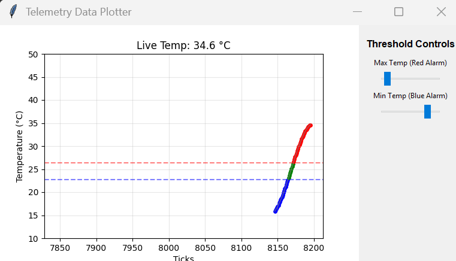

# Tiva C Series Multi-Format UART Telemetry

A hands-on project for the **TM4C123GH6PM** (Tiva C) using **Code Composer Studio**. This project demonstrates how to bridge the gap between embedded firmware and high-level data consumption by outputting simulated temperature data in three distinct formats.

## 🚀 Project Roadmap
* **v0.1:** Basic UART Setup & "Hello World"
* **v0.2:** Human-Readable Dashboard (ANSI Escape Codes & Sinewave Simulation)
* **v0.3:** Machine-Readable Output (JSON/CSV)
* **v1.0:** **(Current)** Python GUI Serial Plotter Integration

---

## 📊 Milestone 2: The Human-Readable Dashboard

In this stage, we transition from a chaotic, scrolling "wall of text" to a clean, static dashboard within the serial terminal.

### Key Features
1. **Sinewave Simulation:** Uses `math.h` to generate a temperature signal oscillating between 15°C and 35°C.
2. **ANSI Control:** Uses escape sequences to manage terminal behavior:
    * `\x1b[2J`: Clears the screen.
    * `\x1b[H`: Moves the cursor to the "Home" position (top-left) to overwrite data without flickering.
3. **Color-Coded Alarms:**
    * **Green:** Normal Operating Temp (20°C - 30°C)
    * **Blue:** Low Temp Alarm (< 20°C)
    * **Red:** High Temp Alarm (> 30°C)

---

## 🤖 Milestone 3: Machine-Readable Formats

To support external applications, the Tiva C can output raw data strings.

* **CSV Format:** `Timestamp, Temperature, Alarm_Code`
* **JSON Format:** `{"t": timestamp, "v": value, "a": alarm_state}`
    * `a = 0`: Normal
    * `a = 1`: Low Alarm
    * `a = 2`: High Alarm

---

## 📈 Milestone 4: Python GUI Integration


The Python application catches the JSON stream and plots it in real-time using `matplotlib`. The graph line color dynamically updates based on the alarm state sent by the Tiva C.

### 🐍 Python Setup
The serial plotter is located in the `Python_Serial_Plotter` directory.

1. **Navigate to the folder:**
   ```bash
   cd Python_Serial_Plotter

---

## 🎮 Milestone 4.5: Interactive Tkinter Control Panel

This stage introduces bi-directional communication. The Python application now acts as a "Controller," allowing you to send commands back to the Tiva C to update alarm thresholds on the fly.



### Key Features
1. **Tkinter Integration:** A structured desktop application embedding the Matplotlib canvas.
2. **Bi-Directional Command Stream:**
    * Moving the **Max Slider** sends `M[value]\n` to the Tiva C.
    * Moving the **Min Slider** sends `L[value]\n` to the Tiva C.
3. **Live Threshold Indicators:** Red and Blue dashed lines on the plot update in real-time as you move the sliders.
4. **Threaded Data Processing:** Serial communication runs on a background thread to ensure the UI remains responsive at high data rates.

### Usage
1. Navigate to the folder:
   ```bash
   cd Python_Serial_Plotter
2. Create and Activate a virual environment:
    * Windows ```python -m venv .venv .venv\Scripts\activate```
    * Linux/Mac: ```python -m venv .venv source .venv/bin/activate```
3. Install dependencies: Essential for matplotlib, pyserial, and tkinter spport.
    ```bash
    pip install -r requirements.txt
2. Run the interactive app:
    ```bash
   python TelemetryApp.py
3. Use the ssliders on the right to adjust the Tiva C's internal alarm logic.
